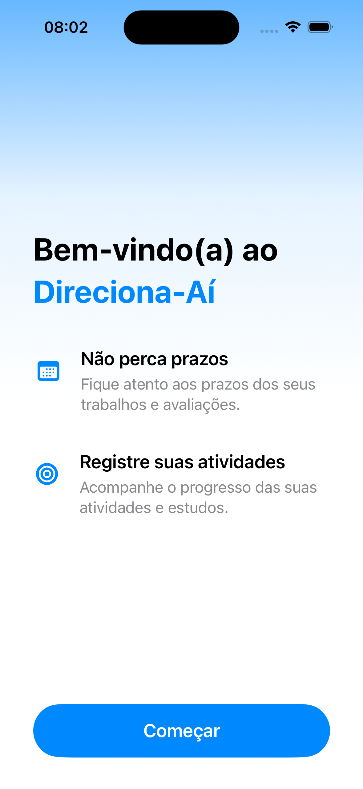
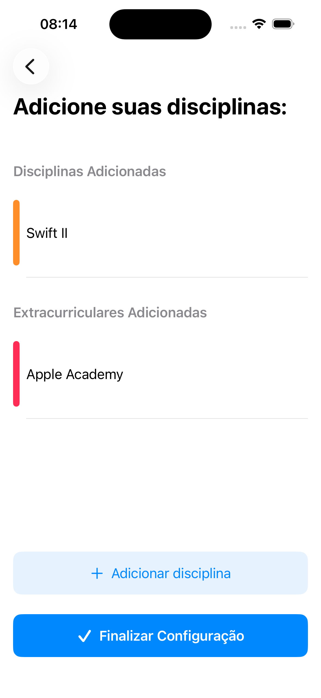
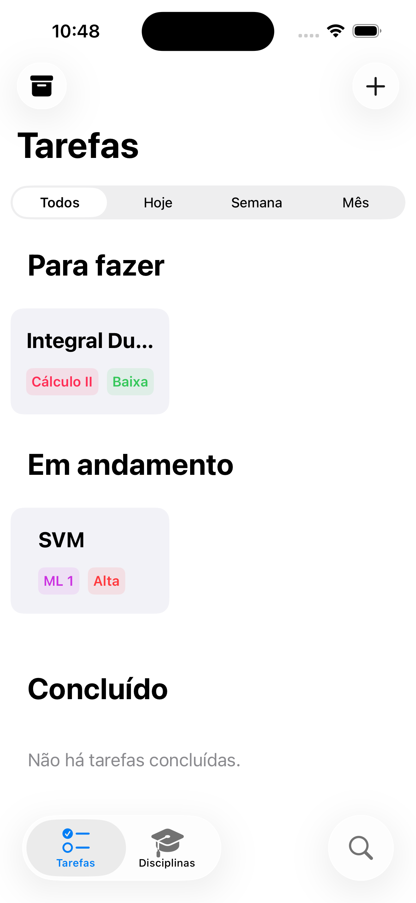
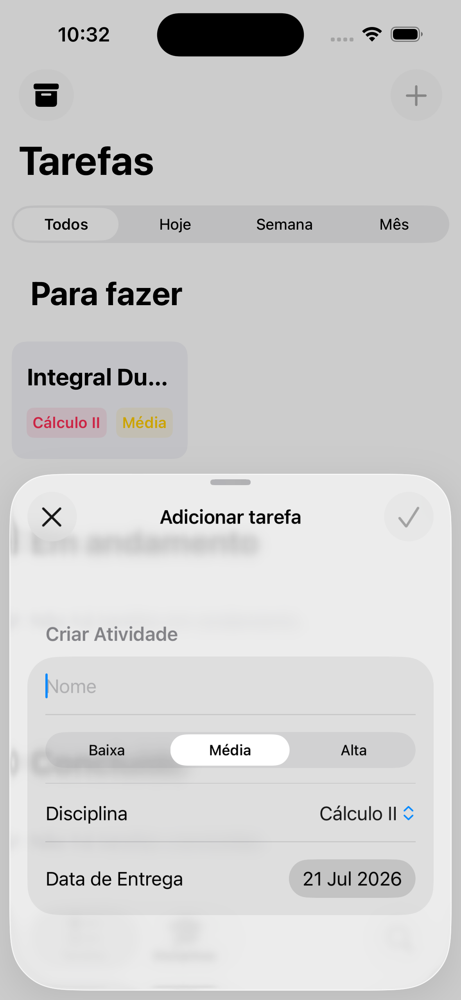
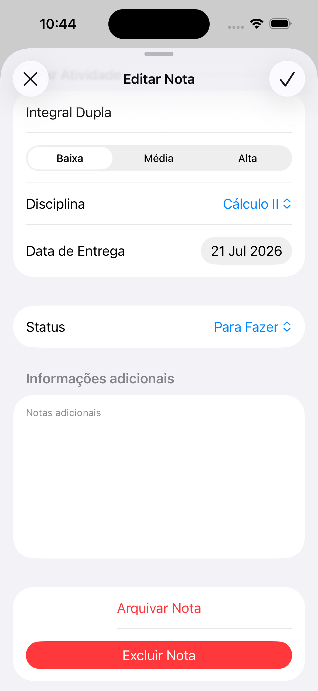
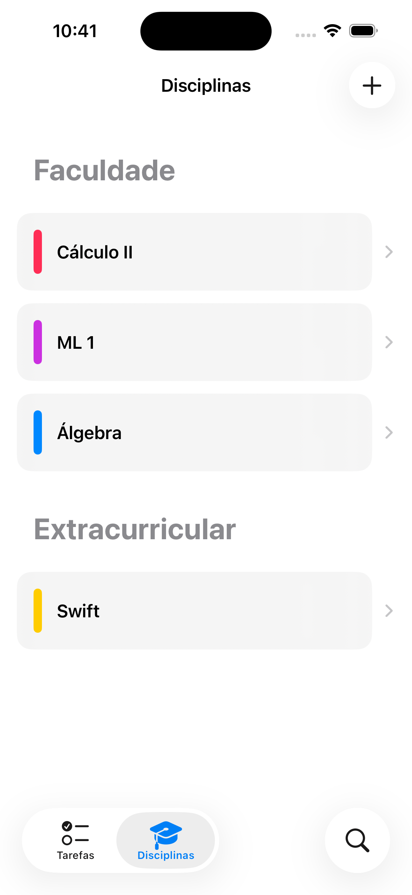
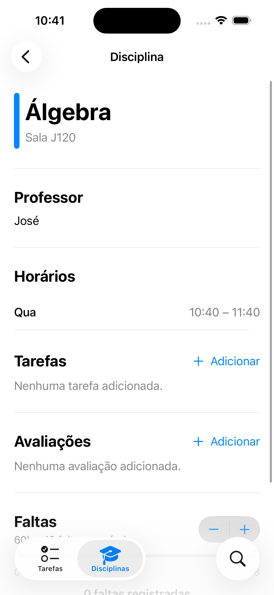

# 🎯 OneTask — Task Tracker Universitário

> Um aplicativo em SwiftUI desenvolvido para ajudar estudantes universitários a gerenciarem suas matérias, tarefas, exames e horários de forma centralizada e intuitiva.

---

## 📝 Sobre o Projeto

O **OneTask** nasceu da necessidade de centralizar a rotina acadêmica. Sabemos que a vida universitária é um caos de prazos, matérias e notas. Este app foi desenhado com foco na experiência do usuário (UX) para garantir que o estudante consiga registrar e visualizar seus compromissos acadêmicos sem atritos, utilizando o que há de mais moderno no ecossistema Apple com **SwiftUI**.

### ✨ Funcionalidades Principais
* **Gerenciamento de Matérias:** Cadastro e visualização de disciplinas do semestre.
* **Tracker de Tarefas:** Criação, detalhamento e arquivamento de entregas/trabalhos.
* **Controle de Exames:** Organização de datas de provas importantes.
* **Cronograma Acadêmico:** Visualização integrada dos horários das aulas.

---

## 📁 Estrutura do Repositório

Abaixo está a organização dos arquivos do projeto, seguindo o padrão de arquitetura focado na separação de Modelos e Views do SwiftUI:

```text
OneTask/
├── CONTRIBUTING.md                # Diretrizes de contribuição
├── README.md                      # Documentação principal do projeto
└── OneTask/
    ├── App/                        # Ciclo de vida e configurações globais do app
    ├── Assets.xcassets             # Ícones, cores personalizadas e imagens
    ├── Models/                     # Estruturas de dados
    │   ├── ExtraCurricular.swift   # Modelo de Atividades Extracurriculares
    │   ├── Subject.swift           # Modelo de Matérias/Disciplinas
    │   └── Task.swift              # Modelo de Tarefas
    │
    └── Views/                      # Telas e Componentes visuais
        ├── Components/             # Subvisões e componentes reutilizáveis
        │   ├── DateLimitSegmentedControl.swift # Controle segmentado de datas da TaskView
        │   ├── S_Task.swift        # Modal/Sheet para criação ou edição de tarefas
        │   ├── TaskDetail.swift    # Componente visual da tarefa na TaskView
        │   └── UserTaskTransfer.swift # Componente para funcionamento do Drag & Drop
        │
        ├── Subjects/               # Fluxo de Matérias, Grade Horária e Extracurriculares
        │   ├── AddExamView.swift   # Tela/Modal para adicionar nota de avaliações
        │   ├── ExtracurricularView.swift # Tela para gerenciamento de atividades extracurriculares
        │   ├── S_AddSubject.swift  # Modal para adicionar disciplina/extracurriculares
        │   ├── SubjectListView.swift # Lista geral de matérias
        │   └── SubjectView.swift   # Detalhes de uma matéria específica
        │
        ├── Tasks/                  # Fluxo de Tarefas
        │   ├── ArchTasksView.swift # Tela de tarefas arquivadas/concluídas
        │   └── TaskView.swift      # Tela principal de listagem de tarefas
        │
        ├── OnboardingAddSubjectView.swift # Etapa de adição de matérias no fluxo de onboarding
        ├── OnboardingView.swift    # Tela de introdução para novos usuários
        └── TabViewStruct.swift     # Barra de navegação inferior do app
```

---

## 📸 Mural de Fotos (Screenshots)

> A interface do nosso aplicativo:

### Onboarding




### Atividades





### Disciplinas




---

## 💻 Membros participantes: 
<table align="center">
  <tr>
    <td align="center">
      <a href="https://github.com/deblemos">
        <br>
        <sub><b>Débora Lemos</b></sub>
      </a>
    </td>
    <td align="center">
      <a href="https://github.com/gabrielbelo2007">
        <br>
        <sub><b>Gabriel Belo</b></sub>
      </a>
    </td>
    <td align="center">
      <a href="https://github.com/micheldeoliveirasilva">
        <br>
        <sub><b>Michel Silva</b></sub>
      </a>
    </td>
  </tr>
</table>

### 📄 Documentação Adicional

- [Guia de Contribuição (CONTRIBUTING.md)](CONTRIBUTING.md) - Padrões de código e branches.
